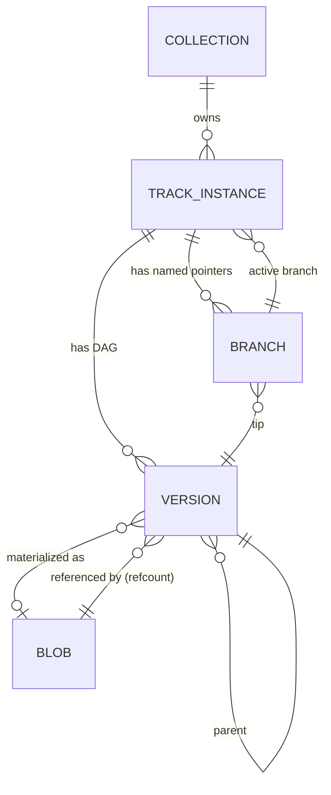
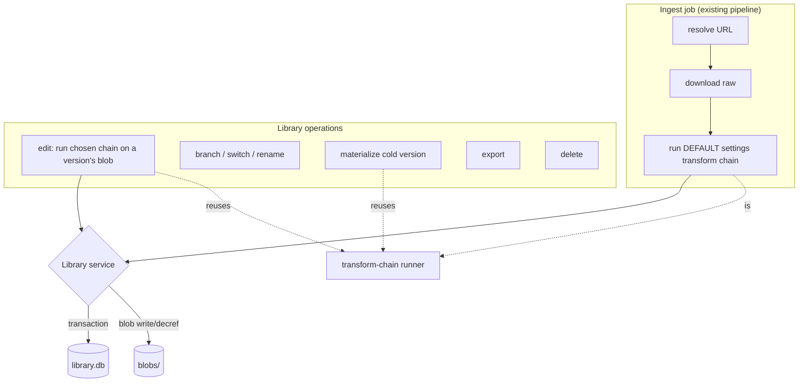

# Library / Editor Model — Design

**Date:** 2026-06-02
**Status:** Draft (awaiting user review)
**Supersedes:** the flat `HistoryEntry[]` model (`src/main/history.ts`, history-in-`config.json`)

---

## 1. Problem & motivation

Today Plucker treats every run as a job that appends a `HistoryEntry` to a flat
`history: HistoryEntry[]` array embedded in `config.json`. Tracks have **no stable
identity** — they are addressed positionally as `(entryId, index)` — and final file
paths are derived purely from ID3 tags + folder. Identical tags + folder ⇒ identical
absolute path.

The concrete bug: re-downloading or re-transforming a track creates a *new* history
entry, but its `HistoryTrack.file` points at the **same physical file** as the
playlist entry's track (same tags, same folder). Deleting the solo entry runs
`rmSync(file)` on the shared path and silently destroys the playlist's copy. There is
no reference counting and no awareness that two history rows can share one file.

We are replacing this with an **editor model**: the app owns a managed, content-
addressed **Library** of audio and tracks every modification as a version, until the
user explicitly **exports**. History stops being the source of truth and becomes a
read-only activity log.

---

## 2. Requirements

### 2.1 Functional

- **F1** — All downloaded/transformed audio lives in an app-managed content store.
  Nothing is written to a user-visible folder until an explicit export.
- **F2** — A track has a stable identity and a **version graph**. The raw yt-dlp
  download is the immutable root; every transform (including auto-tag/rename) is an
  undoable version step.
- **F3** — Users can navigate the version graph (go back/forward) and create
  **explicitly named branches** (e.g. "club edit", "radio cut") off any version.
- **F4** — Deleting any track instance, collection, or version never destroys a blob
  that another version still references (reference counting).
- **F5** — Ingest (download + the default settings transform chain) runs through the
  existing worker pool / pipeline engine and writes its result into the Library.
- **F6** — Library operations (edit, branch, switch, materialize, export, delete,
  reorganize) are first-class operations that reuse the transform-chain runner.
- **F7** — Export is a **one-shot copy**: pick a destination, materialize the current
  version of the selected tracks/collection, write tag-named files there. No tracked
  export relationship.
- **F8** — The Library is the primary navigational surface. History becomes a
  read-only activity timeline derived from an append-only event log.
- **F9** — Old `HistoryEntry[]` data is discarded on upgrade (**fresh start**);
  existing files on disk are left untouched.

### 2.2 Non-functional

- **N1 Integrity** — Reference counts and the version graph must never corrupt, even
  on crash mid-operation. (→ SQLite transactions; blob-on-disk before DB commit.)
- **N2 Crash safety** — A power loss must not leave the DB referencing a half-written
  blob, nor leak blobs forever. (→ atomic blob writes + orphan GC sweep.)
- **N3 Determinism** — A recomputed cold version must byte-for-byte match what the
  user originally produced, including offline. (→ snapshot resolved transform outputs
  into the recipe.)
- **N4 Disk discipline** — The store must not grow without bound from versions. (→
  hybrid materialization: keep root + branch tips + an LRU of interior nodes; older
  interior versions are recipe-only.)
- **N5 Reuse** — Maximize reuse of the just-shipped worker/pipeline/transform-chain
  code; minimize rewrite of the execution engine.

### 2.3 Constraints

- pnpm only. Conventional Commits. Work on `master`, no feature branch.
- Electron main is the sole writer of the Library (renderer talks via IPC), matching
  the existing single-writer history invariant.
- New native dependency: **better-sqlite3** (synchronous, main-process only).

---

## 3. Domain model



- **Collection** — container created by ingest. `id`, `kind: 'playlist'|'album'|'single'`,
  `title`, `sourceUrl`, `createdAt`. A playlist download → one `playlist` collection;
  a single video → its own `single` collection (no shared "Singles" bucket). Owns its
  track instances 1:1.
- **TrackInstance** — one occurrence of a track inside exactly one collection. `id`,
  `collectionId`, `sourceVideoId`, `sourceUrl`, `orderIndex`, `activeBranchId`,
  `sourceAudioHash` (tag-independent hash of the raw download, for "same download?"
  dedup), `title`. **Distinct per occurrence** — the same song in two playlists is two
  instances with two independent version graphs; they may only share *blobs*
  underneath.
- **Version** — a node in the track's DAG. `id`, `trackId`, `parentId` (null for root),
  `blobHash?` (set when materialized), `recipe` (JSON: the transform step(s) +
  **snapshotted resolved outputs** producing this node from its parent; empty for root),
  `materialized: bool`, `createdAt`, `label?`. The **root** is the raw yt-dlp download
  with no recipe.
- **Branch** — a named pointer into the DAG. `id`, `trackId`, `name`, `tipVersionId`.
  Every track is born with a `main` branch whose tip is the default-transformed first
  child (root → default settings chain → first version).
- **Blob** — a row in the content store. `hash` (**full-file SHA-256**), `path`, `size`,
  `refcount`. Physically removed only when `refcount` reaches 0.
- **ActivityEvent** — append-only log row. `id`, `type`
  (`ingested|edited|branched|switched|exported|deleted|renamed|…`), `ts`, ref columns
  (`collectionId?`, `trackId?`, `versionId?`), `summary`. Powers the history view;
  never the source of truth.

### 3.1 "Current" version

`TrackInstance.activeBranchId` is the only persisted notion of current. The current
version = the active branch's `tipVersionId`. In-graph selection (peeking at an older
node) is **transient renderer state**, not persisted.

### 3.2 Branch semantics

- Editing at the **active branch's tip** → produces a new version whose parent is the
  tip; the branch tip advances. (No new branch.)
- Editing from any **non-tip** (historical) node → **requires** creating a new named
  branch first; the new version becomes that branch's tip. This is the explicit-named-
  branch model (Q3).
- Switching = changing `activeBranchId` (and/or transiently viewing a node).

### 3.3 How the bug dies

Delete is never `rmSync(file)`. Deleting a track instance / collection / version runs
in a single SQLite transaction: drop the affected versions & branches → **decref**
every blob they referenced → physically `rm` only blobs whose refcount hit 0. Two
instances of the same source download reference the same raw-root blob at refcount 2;
deleting one leaves the file intact for the other. The collision is structurally
impossible.

---

## 4. Content store & persistence

### 4.1 Layout

```
~/.plucker/
  config.json          # settings only — `history` field removed
  library.db           # SQLite index (better-sqlite3), WAL mode
  blobs/
    ab/ab12…ef.mp3      # sharded by first 2 hex chars of full-file SHA-256
  tmp/                 # working files during transform chains & blob staging
```

### 4.2 SQLite schema (sketch)

```sql
CREATE TABLE collections (
  id TEXT PRIMARY KEY, kind TEXT NOT NULL, title TEXT NOT NULL,
  source_url TEXT, created_at TEXT NOT NULL
);
CREATE TABLE track_instances (
  id TEXT PRIMARY KEY,
  collection_id TEXT NOT NULL REFERENCES collections(id) ON DELETE CASCADE,
  source_video_id TEXT, source_url TEXT, source_audio_hash TEXT,
  order_index INTEGER NOT NULL, title TEXT NOT NULL,
  active_branch_id TEXT NOT NULL
);
CREATE TABLE versions (
  id TEXT PRIMARY KEY,
  track_id TEXT NOT NULL REFERENCES track_instances(id) ON DELETE CASCADE,
  parent_id TEXT REFERENCES versions(id),
  blob_hash TEXT REFERENCES blobs(hash),
  recipe TEXT NOT NULL DEFAULT '[]',     -- JSON steps + snapshotted outputs
  materialized INTEGER NOT NULL DEFAULT 0,
  label TEXT, created_at TEXT NOT NULL
);
CREATE TABLE branches (
  id TEXT PRIMARY KEY,
  track_id TEXT NOT NULL REFERENCES track_instances(id) ON DELETE CASCADE,
  name TEXT NOT NULL, tip_version_id TEXT NOT NULL REFERENCES versions(id)
);
CREATE TABLE blobs (
  hash TEXT PRIMARY KEY, path TEXT NOT NULL, size INTEGER NOT NULL,
  refcount INTEGER NOT NULL DEFAULT 0
);
CREATE TABLE activity (
  id TEXT PRIMARY KEY, type TEXT NOT NULL, ts TEXT NOT NULL,
  collection_id TEXT, track_id TEXT, version_id TEXT, summary TEXT NOT NULL
);
```

Refcount mutation, version creation, and deletion always run inside a transaction.

### 4.3 Blob lifecycle & crash safety (N1, N2)

- **Write:** stage bytes in `tmp/`, `fsync`, compute full-file SHA-256, `rename` into
  `blobs/ab/<hash>.mp3` (atomic on same filesystem). *Then* open the DB transaction
  that inserts/increments the blob row and links the version. Blob-on-disk-before-DB
  means a crash leaves at worst an unreferenced file, never a dangling DB pointer.
- **Dedup:** if a blob with that hash already exists, skip the write and just incref.
- **Orphan GC:** a startup (and on-demand) sweep reconciles `blobs/` against the DB —
  any on-disk blob with no row or refcount 0 is removed; any DB-referenced hash missing
  on disk marks its versions `materialized = 0` (recompute on demand; if the *root* is
  missing, the track is flagged broken).

### 4.4 Materialization policy (N4)

Always-materialized set per track = `{root} ∪ {tip of every branch}`. Plus a global
LRU cache of recently-viewed interior nodes (size budget configurable; default small).
Everything else is **recipe-only** (`materialized = 0`, `blob_hash = NULL`). Visiting a
cold version recomputes it by replaying its recipe from the nearest materialized
ancestor, materializes it, and inserts it into the LRU (evicting the coldest).

---

## 5. Determinism & recipes (N3)

A `recipe` is the ordered list of transform steps that produced a version from its
parent, **plus the resolved outputs of any non-deterministic step**. When a step that
performs external lookups runs (notably `auto-tag` fetching metadata), it records the
*actual values it applied* into the recipe entry. Replay applies the frozen result
instead of re-fetching — so cold-version recompute is byte-stable and works offline.

Each `TransformDefinition` declares what (if anything) it must snapshot. Purely
deterministic transforms (square-cover, trim-silence with fixed params, rename) snapshot
nothing. This is the only change to the transform contract.

---

## 6. Execution model

Two operation classes share the same primitives (yt-dlp download, transform-chain
runner) and the same worker pool — both appear in the existing Job Rail.



- **Ingest job** — the existing `resolve → download → transform` pipeline runs the
  *default settings* chain. Its `JobResult` is folded into the Library by a new
  `foldJobResultIntoLibrary`: create/locate the collection, create a track instance,
  ingest the raw download as the root blob, ingest the default-transformed output as
  the `main` tip version (with its recipe), append an `ingested` activity event.
- **Library operations** — orchestrated by a new **Library service** (main process).
  Edits that run transforms dispatch a small job to the same worker pool so heavy
  ffmpeg/analysis work stays off the main thread and surfaces in the Job Rail. Pure
  metadata operations (branch, switch, rename, delete) run inline in a transaction.

The pipeline/worker/pool/checkpoint code is **kept**. The only thing that changes
downstream is the *result-folding layer* (currently `foldJobResult`/`foldJobError`
writing `HistoryEntry`s → now writing Library rows).

---

## 7. Export (F7)

Export is a one-shot copy:

1. User selects a collection or set of track instances and picks a destination folder.
2. For each track, materialize its **current** version (recompute if cold).
3. Compute the filename from the current version's tags via the existing
   `buildFileName(template, tags)`; honor `downloads.perPlaylistSubfolder` for
   collection exports.
4. Copy the materialized blob to `dest/<name>.mp3`.
5. Append an `exported` activity event. No destination is remembered; re-exporting is
   simply doing it again.

---

## 8. UI surfaces

- **Library (primary)** — collections and their track instances. Open a track to its
  editor: waveform/metadata + the **version graph** (timeline of versions, branch
  pointers, current marker), with actions: edit (apply a chain), create branch, switch
  branch, rename version/branch, delete, export.
- **Activity log** — read-only timeline rendered from the `activity` table (replaces
  the old history view's role as the actionable surface).
- **Job Rail** — unchanged; now shows both ingest jobs and transform-bearing library
  operations.

Detailed visual layout of the version-graph editor is deferred to the implementation
plan / a UI design pass; this spec fixes the model and the available actions, not pixel
layout.

---

## 9. IPC surface

**Removed:** `history:get`, `history:removeEntry`, `history:removeTrack`,
`history:changed`. (`src/main/history.ts` and `entryFiles`/`removeTrack`/etc. deleted.)

**Retained:** all `job:*` and `jobs:*` execution channels (resolve/start/cancel/pause/
resume/skipTrack/list/interrupted/…), `settings:*`, `metadata:*`, `waveform:*`,
`cover:*`, `transforms:catalog`.

**New `library:*` (invoke):**

- `library:getCollections` → collections + track summaries
- `library:getTrack` (trackId) → instance + full version graph + branches
- `library:edit` (trackId, branchId, transformChain) → starts an edit job, new version
- `library:createBranch` (trackId, fromVersionId, name)
- `library:switchBranch` (trackId, branchId)
- `library:renameVersion` / `library:renameBranch`
- `library:deleteVersion` / `library:deleteTrack` / `library:deleteCollection`
- `library:materialize` (versionId) → ensures blob exists (recompute if cold)
- `library:export` (targetIds, destFolder) → one-shot copy
- `library:getActivity` → activity events

**New events (main→renderer push):** `library:changed` (collections/tracks mutated),
`library:activityChanged`.

---

## 10. Migration (F9)

**Fresh start.** On first launch of the new version:

- Remove the `history` field from `config.json` (one-time settings cleanup).
- Do **not** touch any files already on disk in users' download folders.
- The Library (`library.db`, `blobs/`) starts empty.

No migration/import code is written. `src/main/history.ts`, the history IPC handlers,
and the renderer history-view delete/redownload paths are deleted and replaced by the
Library equivalents.

---

## 11. Architecture Decision Records

### ADR-001 — Managed content-addressed store; export-only egress
**Status:** Accepted.
**Context:** Files landing directly in user folders + tag-derived paths caused the
shared-file delete bug and prevented keeping unedited versions.
**Decision:** App owns `~/.plucker/blobs/` (content-addressed by full-file SHA-256);
user folders are written only on explicit export.
**Alternatives:** In-place + version sidecar (folder clutter, awkward branching);
hybrid mirror-on-commit (two sources of truth to sync).
**Consequences:** + structural dedup & refcounting (kills the bug), natural version/
branch storage. − disk holds multiple copies; files don't appear where users expect
until export.

### ADR-002 — SQLite (better-sqlite3) for the Library index
**Status:** Accepted.
**Context:** Refcounts, a version DAG, branches, and an activity log need referential
integrity; a refcount bug = lost or leaked files.
**Decision:** Store the index in SQLite (WAL mode); keep blobs as files.
**Alternatives:** Separate `library.json` (no transactions, full-file rewrites, crash-
corruptible); JSON-behind-an-interface (pay abstraction cost now, still owe SQLite).
**Consequences:** + transactional integrity, queryable, scales. − native dependency
(electron-rebuild step), a schema/migration layer.

### ADR-003 — Distinct track instance per occurrence; dedup at the blob layer
**Status:** Accepted.
**Context:** The same source track can appear in a playlist and as a solo download.
**Decision:** Each occurrence is its own TrackInstance with its own version graph;
they share only blobs via refcounting. Edits to one do not affect the other.
**Alternatives:** One shared track entity referenced by many collections (edits/versions
would carry across occurrences; richer but couples collections).
**Consequences:** + simple identity, bug fixed purely at storage layer. − no shared
edit history across occurrences (acceptable / arguably desirable).

### ADR-004 — Raw download is the immutable version root
**Status:** Accepted.
**Decision:** The root is the audio exactly as yt-dlp produced it; the default settings
chain produces the first child on `main`. Every transform is an undoable step.
**Alternatives:** Default-transformed result as root (can't undo past the default chain);
keep-both with a baseline marker (extra concept).
**Consequences:** + cleanest provenance, true "revert to original". − always store the
raw blob.

### ADR-005 — Explicit named branches (full DAG)
**Status:** Accepted.
**Decision:** Linear advance on the active branch tip; editing a historical node
requires creating a named branch.
**Alternatives:** Auto-fork anonymous tree (simpler, no naming); linear-only (can't keep
alternatives — contradicts the goal).
**Consequences:** + powerful, named alternatives ("club edit"). − more branch-management
UI & state.

### ADR-006 — Hybrid version storage with deterministic recompute
**Status:** Accepted.
**Decision:** Keep blobs for root + every branch tip + an LRU of interior nodes; older
interior versions are recipe-only and recomputed on demand. Non-deterministic steps
snapshot their resolved outputs into the recipe so replay is byte-stable & offline-safe.
**Alternatives:** Materialize every version (instant switch, big disk); recipe-only for
all but original/current (slower revisits); never-evict-impure (less savings).
**Consequences:** + bounded disk, deterministic. − recompute latency on cold visits;
each transform must declare snapshot data; eviction/LRU logic.

### ADR-007 — Keep the execution engine; add a Library service
**Status:** Accepted.
**Decision:** Reuse the worker pool / pipeline / transform-chain runner. Ingest folds
into the Library; library operations are a new main-process service that reuses the
same primitives and the same Job Rail.
**Consequences:** + smallest blast radius on the fresh refactor. − two operation classes
to keep coherent.

### ADR-008 — Fresh-start migration
**Status:** Accepted.
**Decision:** Discard old `history` on upgrade; leave files on disk; Library starts
empty. No import code.
**Alternatives:** Import as single-version tracks (big first-launch copy, complex);
legacy read-only archive (two parallel systems).
**Consequences:** + cleanest code, no migration risk. − users lose their old history
list (acceptable for this app's user base).

### ADR-009 — One-shot export
**Status:** Accepted.
**Decision:** Export copies current materialized files to a chosen folder with no
remembered relationship.
**Alternatives:** Tracked re-exportable targets (staleness tracking); live mirror folder
(ongoing sync engine).
**Consequences:** + simplest. − no "update my exported library" affordance.

---

## 12. Risks & mitigations

| # | Risk | Mitigation |
|---|------|------------|
| R1 | Refcount corruption → lost/leaked files | All mutations in SQLite transactions; blob-on-disk before DB commit; startup orphan-GC reconciliation. |
| R2 | Non-deterministic transform makes a recomputed cold version differ from what the user saw | Snapshot resolved outputs into the recipe (N3/ADR-006); transforms declare snapshot data. |
| R3 | better-sqlite3 native build breaks Electron packaging | Pin version, add `electron-rebuild`/`@electron/rebuild` to the build, verify in CI build matrix (already builds arm64+x64 DMGs). |
| R4 | Disk growth from many materialized versions | Hybrid eviction (N4); expose store size + a "compact/evict" action; cold versions are recipe-only. |
| R5 | Cold-version recompute latency hurts UX | Always keep branch tips materialized; LRU for revisits; run recompute as a Job Rail job with progress. |
| R6 | Big-bang rewrite destabilizes the fresh worker refactor | Phase the build (§14); keep the engine; land the store + refcount delete (the bug fix) first behind the new model. |
| R7 | Blob lost/missing on disk (manual deletion, sync tools) | GC marks affected versions unmaterialized and recomputes; broken root flags the track rather than crashing. |

---

## 13. Testing strategy

- **Unit:** content-store (hash, atomic write, dedup), refcount inc/dec + zero-delete,
  recipe replay determinism (same recipe → identical bytes), materialization/LRU
  eviction, branch rules (tip-advance vs forced-named-branch), fold-into-library.
- **Integration:** ingest a playlist → library rows + blobs correct; re-download same
  track in another collection → second instance, shared raw root at refcount 2; delete
  one → blob survives (the regression test for the original bug); edit → new version;
  branch → named branch; export → correct files on disk; crash-safety (kill between
  blob write and DB commit → orphan GC cleans up).
- All new shared helpers get colocated `*.test.ts` per project conventions.

---

## 14. Phasing (build sequence)

The full vision is specified above; the *build* is sequenced to land the bug fix early
and de-risk the rewrite:

1. **Store + index foundation** — better-sqlite3, schema, content store, blob lifecycle
   + refcount + orphan GC. Library service skeleton. (No UI yet.)
2. **Ingest into library** — swap result-folding from `HistoryEntry` to Library rows;
   raw root + default-chain first version; activity log. Delete old history code.
   *(Bug is dead at this point: refcounted delete.)*
3. **Library UI + activity log** — primary collections/tracks view, read-only activity
   timeline, basic delete/export.
4. **Versioning & editing** — edit op → new version, version graph view, recipe storage
   + deterministic replay, hybrid materialization/LRU.
5. **Named branches** — branch create/switch/rename, historical-node edit rule.
6. **Export polish** — selection, per-playlist subfolders, naming.

Each phase is independently testable and shippable.

---

## 15. Open questions

- Materialization LRU size / store-size budget default (tune in phase 4).
- Whether the activity log is capped or unbounded (lean unbounded with a manual clear).
- Exact version-graph editor visual layout (separate UI pass).
