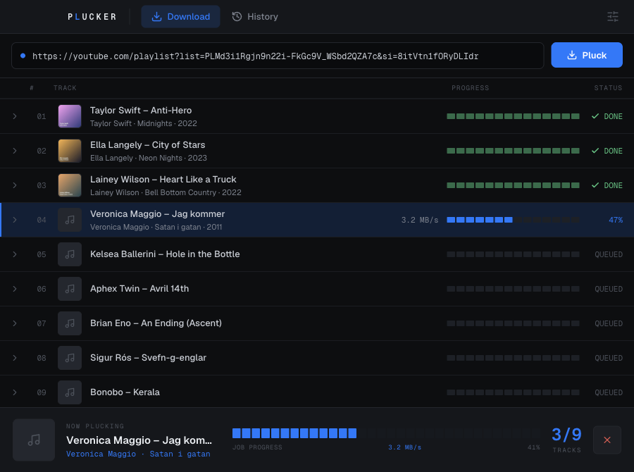
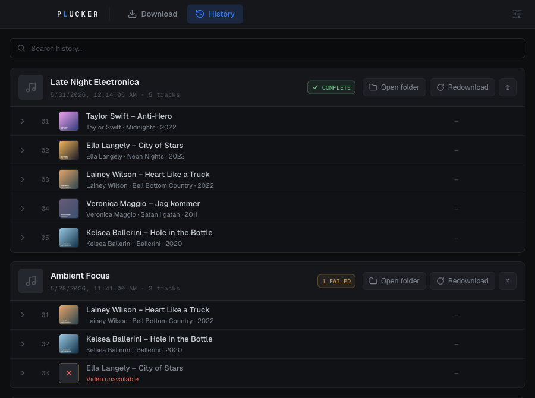
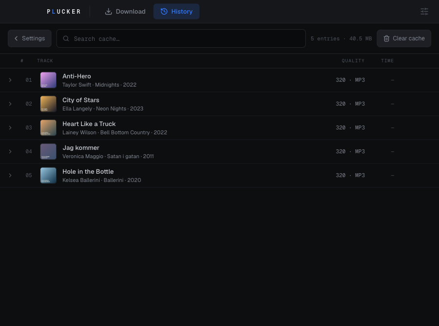
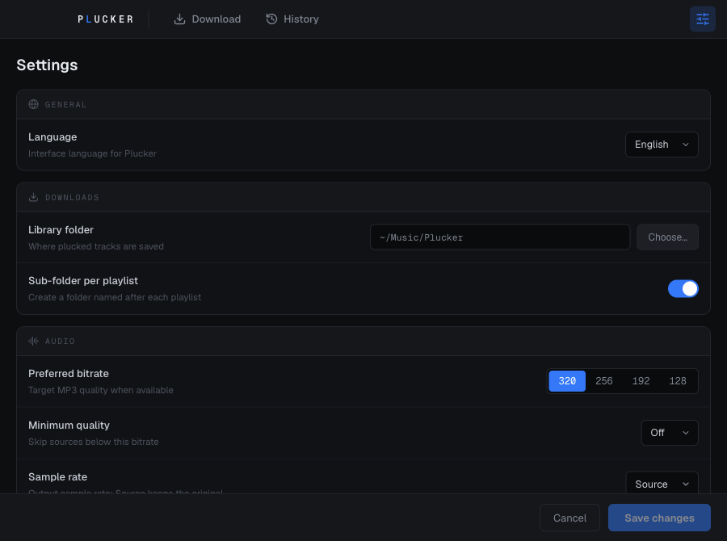

# Plucker

Plucker turns a YouTube playlist or video into a folder of properly tagged MP3s.
Paste a URL, press Pluck, and get files with cover art, artist, album, and year
already filled in — ready to drop into your music library.

It's a macOS desktop app built with Electron, React, and TypeScript. `yt-dlp` and
`ffmpeg` are bundled, so there's nothing else to install.

<p align="center">
  
</p>

## What it does

- **Playlists and single videos** — paste any YouTube playlist or video URL.
- **Tagged output** — each track is written as an MP3 with embedded cover art and
  ID3 metadata (title, artist, album, year).
- **Quality you choose** — target bitrate from 128 up to 320 kbps, an optional
  minimum-quality floor, and source-or-fixed sample rate.
- **A library that stays organised** — pick where tracks are saved and optionally
  give each playlist its own sub-folder.
- **History you can revisit** — every download is recorded; reopen the folder or
  redownload a playlist, and see exactly which tracks failed and why.
- **A cache that saves bandwidth** — already-fetched tracks are reused instead of
  downloaded again, and you can clear it whenever you like.
- **Localised UI** — the interface ships with multiple languages.

### History

Browse past downloads, search them, and redownload or reveal a folder in Finder.
Failed tracks are kept with the reason (for example, _Video unavailable_) so nothing
fails silently.

<p align="center">
  
</p>

### Cache

Fetched tracks are cached with their quality so repeat downloads are instant.

<p align="center">
  
</p>

### Settings

Set the library folder, bitrate, sample rate, and language.

<p align="center">
  
</p>

## Requirements

- Node.js (see `package.json` for the supported version)
- [pnpm](https://pnpm.io/) — the only supported package manager

## Setup

```bash
pnpm install
```

`postinstall` fetches the bundled `yt-dlp` and `ffmpeg` binaries automatically.

## Develop

```bash
pnpm dev        # run the app with HMR
pnpm test       # run the vitest suite
pnpm lint       # eslint
pnpm typecheck  # tsc (node + web)
```

## Build

```bash
pnpm build:mac  # package unsigned arm64 + x64 DMGs
```

## Releases

Releases are automated with [release-please](https://github.com/googleapis/release-please).
Commits must follow [Conventional Commits](https://www.conventionalcommits.org/) — the
prefix drives the version bump. Merging the auto-generated Release PR tags the release
and uploads the built DMGs. See [`CLAUDE.md`](./CLAUDE.md) for the full workflow.
